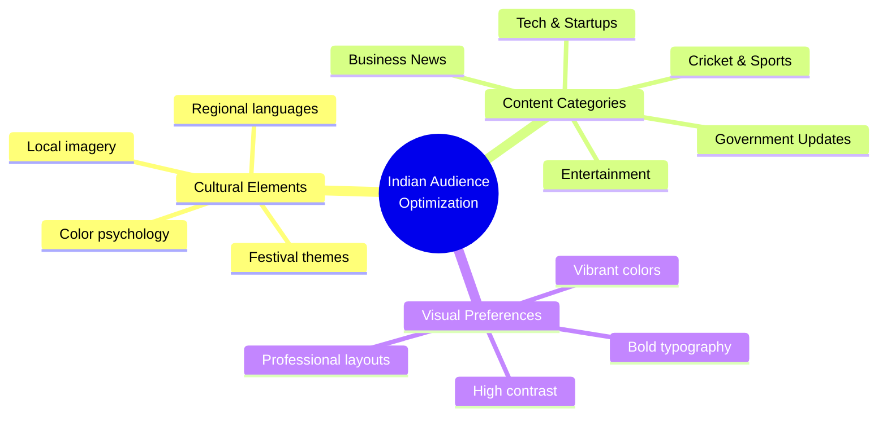
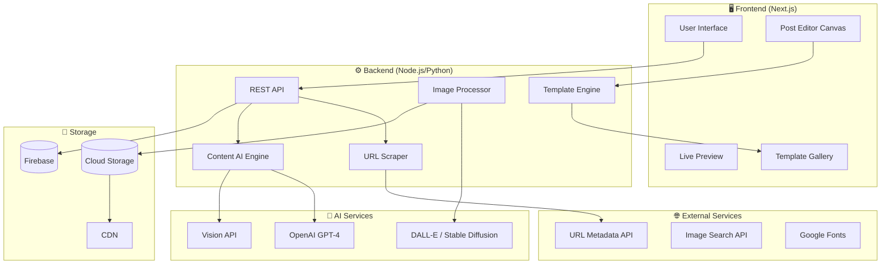
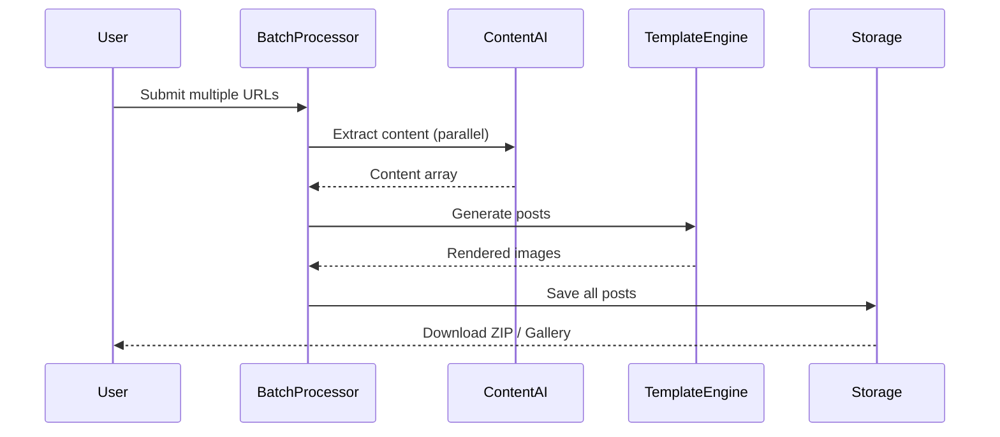
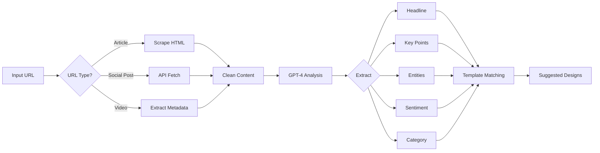

# 🎨 AI Post Designer - Ultimate Implementation Plan

> **Vision**: Build a full-scale, AI-powered social media post designer that automatically generates visually stunning posters optimized for Indian audiences from any URL, text, or context.

---

## 📋 Table of Contents

1. [Project Overview](#project-overview)
2. [Reference Design Analysis](#reference-design-analysis)
3. [Core Architecture](#core-architecture)
4. [Feature Breakdown](#feature-breakdown)
5. [Technology Stack](#technology-stack)
6. [Implementation Phases](#implementation-phases)
7. [AI Integration Strategy](#ai-integration-strategy)
8. [Template System](#template-system)
9. [API Design](#api-design)
10. [Security & Access Control](#security--access-control)
11. [Verification Plan](#verification-plan)

---

## 🎯 Project Overview

### What We're Building

A comprehensive web application that:

| Feature | Description |
|---------|-------------|
| **URL Intelligence** | Paste any link → AI extracts headline, summary, images, and key quotes |
| **Context Understanding** | Provide text/topic → AI researches and generates relevant content |
| **Dynamic Templates** | 50+ professionally designed templates optimized for Indian audiences |
| **Smart Image Handling** | Auto-fetch, enhance, and position images with AI |
| **Brand Customization** | Custom logos, colors, fonts, and consistent branding |
| **Batch Processing** | Generate multiple posts in one go for repetitive tasks |
| **Export Options** | Multiple formats (Instagram, Twitter/X, LinkedIn, Facebook) |
| **Scheduling** | Schedule posts for future publishing |

### Target Audience Optimization (India-Focused)



---

## 🖼️ Reference Design Analysis

Based on the uploaded reference images, here's what our templates must achieve:

### Design Pattern 1: Quote/Insight Posts

**Key Elements:**
- Large hero image (person/subject)
- Dark gradient overlay at bottom
- Brand logo with accent color
- Bold white text with emphasis
- Swipe indicator for carousel
- Rounded corners

### Design Pattern 2: News/Headlines

**Key Elements:**
- Full-bleed action photo
- Red accent bar for headline
- Highlighted keywords
- Brand logo in corner
- Navigation arrows
- Subtitle in lighter weight

### Design Pattern 3: Split Layout

**Key Elements:**
- Two-column image layout
- Clean white text area
- Colored name highlights
- Social media icons footer
- Website URL branding

### Design Pattern 4: Story Format

**Key Elements:**
- Circular inset image (founder/CEO)
- Yellow highlight boxes
- Minimal brand logo
- Dark background with light text

### Design Pattern 5: News/Government

**Key Elements:**
- Dramatic imagery
- White highlight boxes for key stats
- Dual-color brand logo (ISM DU style)
- Vertical watermark
- Gray subtitle text

---

## 🏗️ Core Architecture



---

## 📦 Feature Breakdown

### Phase 1: Core Features (MVP)

#### 1.1 Input Methods

| Method | Description | Priority |
|--------|-------------|----------|
| **URL Input** | Paste any link, auto-extract content | 🔴 Critical |
| **Text Input** | Manually enter headline/body | 🔴 Critical |
| **Image Upload** | Upload custom images | 🔴 Critical |
| **Topic Search** | AI generates content from topic | 🟡 High |

#### 1.2 Content Intelligence Engine

```typescript
interface ContentExtraction {
  url: string;
  title: string;
  summary: string;
  keyQuotes: string[];
  images: {
    url: string;
    alt: string;
    isFeatured: boolean;
  }[];
  entities: {
    people: string[];
    organizations: string[];
    locations: string[];
  };
  sentiment: 'positive' | 'negative' | 'neutral';
  category: ContentCategory;
  suggestedHashtags: string[];
}

type ContentCategory = 
  | 'tech_startup'
  | 'sports_cricket'
  | 'business_finance'
  | 'government_policy'
  | 'entertainment'
  | 'general_news';
```

#### 1.3 Template System

```
templates/
├── quote-posts/
│   ├── tech-leader.json
│   ├── motivational.json
│   └── business-insight.json
├── news-posts/
│   ├── breaking-news.json
│   ├── sports-update.json
│   └── government-news.json
├── story-posts/
│   ├── founder-spotlight.json
│   ├── company-news.json
│   └── achievement.json
└── custom/
    └── user-templates/
```

#### 1.4 Editor Canvas

> [!IMPORTANT]
> The editor must support real-time preview with drag-and-drop functionality.

**Canvas Features:**
- [ ] Drag & drop elements (text, images, logos)
- [ ] Real-time preview
- [ ] Zoom & pan controls
- [ ] Layer management
- [ ] Undo/redo history
- [ ] Grid & snap guides
- [ ] Responsive resize for different platforms

### Phase 2: Advanced Features

#### 2.1 Batch Processing



#### 2.2 Brand Kit Management

```typescript
interface BrandKit {
  id: string;
  name: string;
  logo: {
    primary: string;    // URL or base64
    secondary?: string;
    icon?: string;
  };
  colors: {
    primary: string;
    secondary: string;
    accent: string;
    text: string;
    background: string;
  };
  fonts: {
    heading: GoogleFont;
    body: GoogleFont;
    accent?: GoogleFont;
  };
  watermark?: {
    text: string;
    position: 'top-left' | 'top-right' | 'bottom-left' | 'bottom-right';
  };
}
```

#### 2.3 Lock & Access Control

| Feature | Free Tier | Pro Tier | Enterprise |
|---------|-----------|----------|------------|
| Basic Templates | ✅ 10 | ✅ All | ✅ All |
| AI Content Generation | ❌ | ✅ 100/mo | ✅ Unlimited |
| Batch Processing | ❌ | ✅ 10/batch | ✅ 100/batch |
| Brand Kits | 1 | 5 | Unlimited |
| Custom Templates | ❌ | ✅ | ✅ |
| Remove Watermark | ❌ | ✅ | ✅ |
| API Access | ❌ | ❌ | ✅ |

### Phase 3: Automation & Scheduling

#### 3.1 Scheduler System

```typescript
interface ScheduledPost {
  id: string;
  postData: PostData;
  platforms: Platform[];
  scheduledAt: Date;
  timezone: string;
  status: 'pending' | 'published' | 'failed';
  repeatConfig?: {
    frequency: 'daily' | 'weekly' | 'monthly';
    endDate?: Date;
  };
}
```

#### 3.2 Repetitive Task Templates

For recurring content (daily quotes, weekly news roundups):

```yaml
# Example: Daily Tech Quote Workflow
name: "Daily Tech Quote"
trigger:
  schedule: "0 9 * * *"  # 9 AM daily
  timezone: "Asia/Kolkata"
source:
  type: "rss_feed"
  url: "https://techcrunch.com/feed"
  filter:
    categories: ["startups", "tech"]
template: "quote-posts/tech-leader"
brand_kit: "my-brand"
output:
  platforms: ["instagram", "twitter"]
  auto_post: false  # Save as draft
```

---

## 🛠️ Technology Stack

### Frontend

| Technology | Purpose |
|------------|---------|
| **Next.js 14+** | React framework with App Router |
| **TypeScript** | Type safety |
| **Fabric.js** | Canvas manipulation for editor |
| **Framer Motion** | Animations |
| **Tailwind CSS** | Styling |
| **Zustand** | State management |
| **React Query** | Server state management |

### Backend

| Technology | Purpose |
|------------|---------|
| **Node.js + Express** | API server |
| **Python (FastAPI)** | AI/ML microservices |
| **Puppeteer/Playwright** | URL scraping |
| **Sharp** | Image processing |
| **Bull/BullMQ** | Job queues for batch processing |

### AI Services

| Service | Use Case |
|---------|----------|
| **OpenAI GPT-4** | Content understanding, text generation |
| **OpenAI Vision** | Image analysis |
| **DALL-E 3** | Image generation |
| **Gemini Pro** | Fallback/alternative AI |

### Infrastructure

| Service | Use Case |
|---------|----------|
| **Firebase Hosting** | Frontend hosting (Next.js with SSR) |
| **Firebase Auth** | Authentication |
| **Firestore** | Database |
| **Firebase Storage** | Image/asset storage & CDN |
| **Cloud Functions** | Backend/API (if needed) |
| **Upstash Redis** | Rate limiting, caching |

---

## 📅 Implementation Phases

### Phase 1: Foundation (Weeks 1-3)

```
Week 1: Project Setup & Core UI
├── [ ] Initialize Next.js project with TypeScript
├── [ ] Set up Firebase (Auth, Firestore, Storage)
├── [ ] Create base layout and navigation
├── [ ] Implement authentication flow
└── [ ] Build template gallery UI

Week 2: Content Engine
├── [ ] Build URL scraper service
├── [ ] Integrate OpenAI for content extraction
├── [ ] Create content parsing pipeline
├── [ ] Build image fetching service
└── [ ] Implement content preview

Week 3: Editor Canvas
├── [ ] Set up Fabric.js canvas
├── [ ] Implement template rendering
├── [ ] Add text editing capabilities
├── [ ] Build image placement system
└── [ ] Create export functionality
```

### Phase 2: Templates & AI (Weeks 4-6)

```
Week 4: Template System
├── [ ] Design 20 core templates
├── [ ] Build template JSON schema
├── [ ] Implement template loader
├── [ ] Create template customization UI
└── [ ] Add template categories

Week 5: AI Enhancement
├── [ ] Build AI suggestion engine
├── [ ] Implement auto-layout optimization
├── [ ] Add smart color matching
├── [ ] Create headline generator
└── [ ] Build hashtag suggester

Week 6: Brand Kit & Customization
├── [ ] Build brand kit manager
├── [ ] Implement font system
├── [ ] Create color palette editor
├── [ ] Add logo management
└── [ ] Build template customizer
```

### Phase 3: Advanced Features (Weeks 7-9)

```
Week 7: Batch Processing
├── [ ] Design batch processing UI
├── [ ] Build job queue system
├── [ ] Implement parallel processing
├── [ ] Create progress tracking
└── [ ] Add bulk export

Week 8: Access Control & Locking
├── [ ] Implement tier system
├── [ ] Build feature flags
├── [ ] Create usage tracking
├── [ ] Add payment integration
└── [ ] Build admin dashboard

Week 9: Polish & Optimization
├── [ ] Performance optimization
├── [ ] Mobile responsiveness
├── [ ] Error handling
├── [ ] Analytics integration
└── [ ] Documentation
```

---

## 🤖 AI Integration Strategy

### Content Understanding Flow



### AI Prompts Structure

```typescript
const CONTENT_EXTRACTION_PROMPT = `
Analyze this article and extract structured information for creating 
a social media post targeting Indian audiences.

Article: {article_content}

Extract:
1. A catchy headline (max 15 words, attention-grabbing)
2. Key quote or statistic that would resonate with Indian readers
3. 3-5 relevant hashtags (include #India related if applicable)
4. Sentiment (positive/negative/neutral)
5. Category (tech_startup/sports_cricket/business_finance/government_policy/entertainment/general_news)
6. Suggested visual style (quote_post/news_headline/story_format/split_layout)

Return as JSON.
`;

const INDIAN_AUDIENCE_OPTIMIZATION = `
Optimize this content for Indian social media audiences:
- Use culturally relevant references
- Include India-specific context if applicable
- Suggest trending Indian hashtags
- Recommend posting time for IST timezone
`;
```

---

## 📐 Template System Design

### Template JSON Schema

```json
{
  "$schema": "https://json-schema.org/draft/2020-12/schema",
  "type": "object",
  "properties": {
    "id": { "type": "string" },
    "name": { "type": "string" },
    "category": { "type": "string" },
    "dimensions": {
      "type": "object",
      "properties": {
        "width": { "type": "number" },
        "height": { "type": "number" },
        "platform": { "type": "string" }
      }
    },
    "layers": {
      "type": "array",
      "items": {
        "type": "object",
        "properties": {
          "id": { "type": "string" },
          "type": { "enum": ["image", "text", "shape", "logo"] },
          "position": {
            "type": "object",
            "properties": {
              "x": { "type": "number" },
              "y": { "type": "number" },
              "width": { "type": "number" },
              "height": { "type": "number" }
            }
          },
          "style": { "type": "object" },
          "binding": { "type": "string" }
        }
      }
    },
    "bindings": {
      "type": "object",
      "description": "Maps content fields to layer IDs"
    }
  }
}
```

### Sample Template: Quote Post

```json
{
  "id": "quote-tech-leader",
  "name": "Tech Leader Quote",
  "category": "quote-posts",
  "dimensions": {
    "width": 1080,
    "height": 1350,
    "platform": "instagram"
  },
  "layers": [
    {
      "id": "bg-image",
      "type": "image",
      "position": { "x": 0, "y": 0, "width": 1080, "height": 800 },
      "binding": "heroImage"
    },
    {
      "id": "gradient-overlay",
      "type": "shape",
      "position": { "x": 0, "y": 600, "width": 1080, "height": 750 },
      "style": {
        "fill": "linear-gradient(to bottom, transparent, #000)"
      }
    },
    {
      "id": "brand-logo",
      "type": "logo",
      "position": { "x": 400, "y": 820, "width": 280, "height": 40 },
      "binding": "brandLogo"
    },
    {
      "id": "quote-text",
      "type": "text",
      "position": { "x": 60, "y": 900, "width": 960, "height": 400 },
      "style": {
        "fontFamily": "Outfit",
        "fontSize": 48,
        "fontWeight": "bold",
        "color": "#FFFFFF",
        "textAlign": "center",
        "lineHeight": 1.3
      },
      "binding": "headline"
    },
    {
      "id": "swipe-indicator",
      "type": "shape",
      "position": { "x": 460, "y": 1300, "width": 160, "height": 20 },
      "style": {
        "dots": 8,
        "activeIndex": 0,
        "color": "#666666",
        "activeColor": "#FFFFFF"
      }
    }
  ],
  "bindings": {
    "heroImage": "images[0]",
    "headline": "keyQuotes[0] || title",
    "brandLogo": "brandKit.logo.primary"
  }
}
```

---

## 🔐 Security & Access Control

### Feature Locking System

```typescript
interface FeatureFlag {
  id: string;
  name: string;
  tiers: ('free' | 'pro' | 'enterprise')[];
  limits?: {
    free?: number;
    pro?: number;
    enterprise?: number;
  };
}

const FEATURES: FeatureFlag[] = [
  {
    id: 'ai_generation',
    name: 'AI Content Generation',
    tiers: ['pro', 'enterprise'],
    limits: { pro: 100, enterprise: -1 } // -1 = unlimited
  },
  {
    id: 'batch_processing',
    name: 'Batch Processing',
    tiers: ['pro', 'enterprise'],
    limits: { pro: 10, enterprise: 100 }
  },
  {
    id: 'custom_templates',
    name: 'Custom Templates',
    tiers: ['pro', 'enterprise']
  },
  {
    id: 'remove_watermark',
    name: 'Remove Watermark',
    tiers: ['pro', 'enterprise']
  },
  {
    id: 'api_access',
    name: 'API Access',
    tiers: ['enterprise']
  }
];
```

### Usage Tracking

```typescript
interface UsageRecord {
  userId: string;
  feature: string;
  count: number;
  period: string; // e.g., "2026-01"
  limit: number;
  lastUsed: Date;
}

// Firestore collection: users/{userId}/usage/{period}
```

---

## ✅ Verification Plan

### Automated Testing

#### Unit Tests

```bash
# Run unit tests
npm run test:unit

# Test coverage
npm run test:coverage
```

**Test Files to Create:**
- `src/__tests__/content-extractor.test.ts` - URL content extraction
- `src/__tests__/template-renderer.test.ts` - Template rendering
- `src/__tests__/ai-integration.test.ts` - AI service integration
- `src/__tests__/feature-flags.test.ts` - Access control

#### Integration Tests

```bash
# Run integration tests
npm run test:integration
```

**Test Scenarios:**
1. URL input → Content extraction → Template generation
2. Batch processing → Queue management → Parallel execution
3. User authentication → Feature access → Usage tracking

### Manual Verification

#### Browser Testing Checklist

| Test Case | Steps | Expected Result |
|-----------|-------|-----------------|
| URL Input | 1. Paste news URL<br>2. Click "Generate" | Content extracted, template suggested |
| Template Selection | 1. Browse templates<br>2. Click template | Template applied to canvas |
| Editor Functions | 1. Edit text<br>2. Move elements<br>3. Change colors | Real-time preview updates |
| Export | 1. Click "Export"<br>2. Select format | Image downloaded correctly |
| Batch Mode | 1. Add 5 URLs<br>2. Click "Generate All" | All 5 posts created |

#### Performance Benchmarks

| Metric | Target | Measurement Method |
|--------|--------|-------------------|
| Initial Load | < 3s | Lighthouse |
| URL Processing | < 5s | Console timing |
| Template Render | < 500ms | Performance API |
| Image Export | < 2s | Performance API |

---

## 📂 Proposed File Structure

```
post-designer/
├── app/                          # Next.js App Router
│   ├── (auth)/
│   │   ├── login/
│   │   └── register/
│   ├── (dashboard)/
│   │   ├── dashboard/
│   │   ├── templates/
│   │   ├── brand-kit/
│   │   └── history/
│   ├── editor/
│   │   └── [id]/
│   ├── api/
│   │   ├── content/
│   │   ├── templates/
│   │   ├── generate/
│   │   └── export/
│   └── layout.tsx
├── components/
│   ├── editor/
│   │   ├── Canvas.tsx
│   │   ├── Toolbar.tsx
│   │   ├── LayerPanel.tsx
│   │   └── PropertyPanel.tsx
│   ├── templates/
│   │   ├── TemplateCard.tsx
│   │   └── TemplateGallery.tsx
│   └── ui/
├── lib/
│   ├── ai/
│   │   ├── content-extractor.ts
│   │   ├── image-analyzer.ts
│   │   └── openai-client.ts
│   ├── canvas/
│   │   ├── fabric-setup.ts
│   │   └── export.ts
│   ├── scraper/
│   │   └── url-scraper.ts
│   └── firebase/
├── templates/
│   ├── quote-posts/
│   ├── news-posts/
│   └── story-posts/
├── public/
│   ├── fonts/
│   └── assets/
└── docs/
    ├── ULTIMATE_PLAN.md          # This file
    ├── API_REFERENCE.md
    └── TEMPLATE_GUIDE.md
```

---

## 🚀 Getting Started (After Approval)

Once this plan is approved, I will begin with:

1. **Initialize the Next.js project** with TypeScript and Tailwind CSS
2. **Set up Firebase** configuration for auth 
3. **Create the base UI components** and navigation
4. **Implement the URL scraper** and content extraction
5. **Build the first 5 templates** based on reference designs

---

> [!NOTE]
> This plan is designed to be modular. Each phase can be adjusted based on feedback and priorities. The core MVP (Phase 1) focuses on the essential workflow: **Input → AI Processing → Template → Export**.

---

**Document Version:** 1.0  
**Created:** January 16, 2026  
**Status:** Awaiting Review
